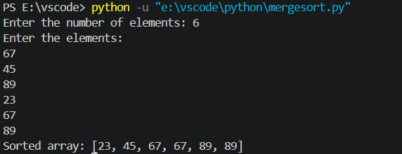

# Merge Sort in Python

## 📌 Description
This project implements the **Merge Sort** algorithm in Python. It takes an array as input from the user, sorts the array using the Merge Sort algorithm, and displays the sorted output.

## 🚀 Features
- Accepts user input
- Uses the Divide and Conquer approach
- Efficient sorting with O(n log n) time complexity
- Easy-to-understand Python implementation

## 🛠️ Requirements
- Python 3.x

## ▶️ How to Run

1. Open the project in VS Code.
2. Open the terminal.
3. Run the following command:

```bash
python mergesort.py
```
## 📷 Output Screenshot


